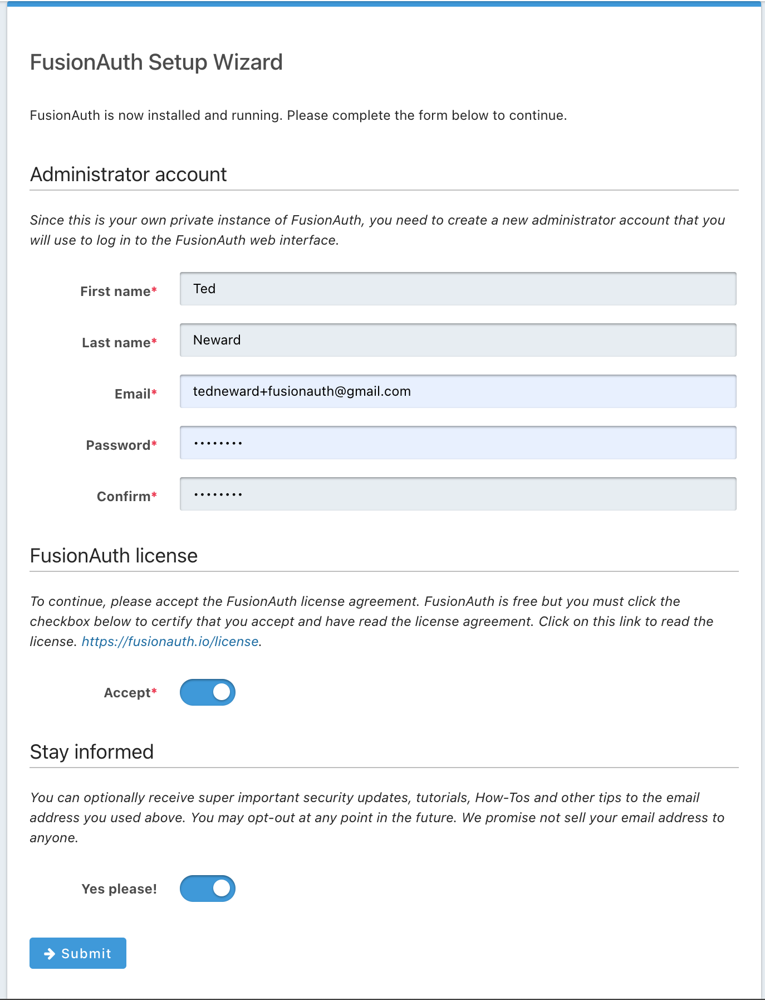

# Getting Started with ASP.NET Core 6

This document will discuss what's needed to get FusionAuth to work with ASP.NET Core 6. (While much of this document will be backwards-compatible with previous versions of ASP.NET, the code was written for v6, and it's likely some adaptations will be necessary to get it working with previous versions of ASP.NET Core.)

## Concepts
Fundamentally, hooking ASP.NET Core up to FusionAuth for auth is simple: since FusionAuth is an OpenID provider, and ASP.NET Core has built-in classes and configurators to make use of OpenID, it's a matter of getting the right configurators in place and then making use of the traditional ASP.NET mechanisms to define which pages are under "auth boundaries".

Having said that, getting all the right pieces in the right places can be overwhelming, particularly given the fact that many of these terms and protocols are poorly-understood by many developers who don't make a living in the InfoSec/Auth space.

## Prerequisites
Before we get started, it's important to note what needs to be on your machine in order to make this project work.

* [ASP.NET Core 6]() (presumably as part of [.NET Core 6]()): Something of a given, if we want to be writing an application with ASP.NET Core.
* [Visual Studio]() or [Visual Studio for Mac](): Certainly VS Code is also a popular tool for writing .NET applications, but the Visual Studio IDE tooling does a couple of things that makes it easier for developers to get started that is trickier to reproduce "by hand" on the raw underlying operating system.
* [FusionAuth]() will need to be available; the easiest way to do this is to [install it as a Docker container on the local machine]().

## Background: Our Awesome Application
We have a very simple existing Web application, one which provides just a couple of web pages:

* Home page
* Secrets page (where sensitive stuff is kept and displayed)
* Public page (that anyone can look at)

For this most simple of applications, we want only people we know to be able to view the Secrets page (it has super-secret stuff on it!), but anybody can see the public page. (Pedagogically, this is to make sure that our example has both authentication-required and freely-available Web assets, since that is a common requirement for many applications, and it would be a little unreasonable to not support both.)

Our ASP.NET application is a stock ASP.NET Core starting template, with a few necessary changes.

First, the `Home/Index.cshtml` view contains a hyperlink to the secret page:

```c#
@{
    ViewData["Title"] = "Home Page";
}

<div class="text-center">
    <h1 class="display-4">Welcome</h1>
    <p>Learn about <a href="https://docs.microsoft.com/aspnet/core">building Web apps with ASP.NET Core</a>.</p>
</div>

<a asp-area="" asp-controller="Secrets" asp-action="Index">View Our Deep Secrets</a>
```

As the hyperlink implies, we have a different controller and view hierarchy for our "secret stuff"; the view itself is stored in `Views/Secrets`, and contains just the one page, `Index.cshtml`:

```c#
@{
    ViewData["Title"] = "Secrets Page";
}

<div class="text-center">
    <h1 class="display-4">SHHHHHH!</h1>
    <p>These are all our deep, dark secrets:</p>
    ...
</div>
```

(We can't show you the actual secrets, you haven't authenticated yet!)

This in turn is backed by the `SecretsController`, which is really a pretty straightforward ASP.NET controller class, different from the HomeController only by the presence of the `[Authorized]` attribute on the route for the secrets page:

```c#
namespace ASPNETOAuth.Controllers
{
    public class SecretsController : Controller
    {
        // GET: /&lt;controller>/
        [Authorize]
        public IActionResult Index()
        {
            return View();
        }
    }
}
```

From a code perspective, this is really all that's necessary; the ASP.NET Core runtime services handle the "heavy lifting" of the rest of the work... provided they have been configured correctly. (For those who aren't familiar with ASP.NET Core's architecture, it is built as a collection of "middleware services", with each service (such as HTTP routing) provided by a "service handler" that performs the actual work when requested.

These services are configured, registered, and installed at the startup of the ASP.NET hosting process, which in ASP.NET Core 6 takes place in the top-level `Program.cs` code.

```c#
// Program.cs (as scaffolded out by the template)
public class Program
{
    public static void Main(string[] args)
    {
        var builder = WebApplication.CreateBuilder(args);

        // Add services to the container.
        builder.Services.AddControllersWithViews();

        var app = builder.Build();

        // Configure the HTTP request pipeline.
        if (!app.Environment.IsDevelopment())
        {
            app.UseExceptionHandler("/Home/Error");
            // The default HSTS value is 30 days. You may want to change this for production scenarios, see https://aka.ms/aspnetcore-hsts.
            app.UseHsts();
        }

        app.UseHttpsRedirection();
        app.UseStaticFiles();

        app.UseRouting();

        app.UseAuthorization();

        app.MapControllerRoute(
            name: "default",
            pattern: "{controller=Home}/{action=Index}/{id?}");

        app.Run();
    }
}
```

(Note that ASP.NET Core 6 can make use of the .NET Core 6 feature called "top-level statements" to avoid the need for writing an explicit containing class and `Main()` method, but being something of an old-school C# developer, I prefer to see the class and method, particularly since the ASP.NET Core template already wrote it for me. Honestly, though, the code will be the same in either case--just indented differently.)

Out of the box, the ASP.NET code doesn't support authentication/authorization. Notice, however, how the web application is "built" in two steps: first, a web application "builder" is created to set up the middleware services that the application will need (such as MVC support), and once that is ready and the application "built", the app is configured via a variety of "UseSomethingInteresting()" methods that know how to configure the ASP.NET pipeline to respond appropriately to certain kinds of incoming requests. At this point, this is all boilerplate ASP.NET template, so it shouldn't be new for the ASP.NET Core developer.

## Install: FusionAuth
There's multiple ways to get FusionAuth on your system--[this link]() has links to all the download options, but my personal preference is to use Docker when trying out new things. It's much easier to get the FusionAuth service (and its dependent Postgres database) up and running, and it doesn't "clog up" anything else running on my machine.

[This link]() describes how to install via Docker, but fundamentally, if you have Docker installed, it's a three-line bash exericse:

```bash
curl -fsSL https://raw.githubusercontent.com/FusionAuth/fusionauth-containers/master/docker/fusionauth/docker-compose.yml > docker-compose.yml && \
curl -fsSL https://raw.githubusercontent.com/FusionAuth/fusionauth-containers/master/docker/fusionauth/.env > .env && \
docker-compose up
```

This will download to files (`docker-compose.yml` and `.env`), then run `docker-compose` to download the Docker images specified in the YAML file and run them using the environment variables specified in `.env`. That's really it for the main install process, but there is a tiny bit of configuration you need to do once the images are downloaded and started.

You'll know FusionAuth is up and running when it prints "Starting FusionAuth HTTP server on port [9011]" as part of a log message to the terminal window in which you issued the `docker-compose` command.

## Configure: FusionAuth Setup Wizard
Once FusionAuth is up and running, we need to configure admin credentials, so that we can access the Dashboard and be able to do all the interesting and useful configuration things that admins do (like setting up applications, adding users, configuring options, and so on).

By default, FusionAuth runs on port 9011 on your local machine, so [open it](http://localhost:9011), and you should be greeted with a configuration screen like so:



This is the Setup Wizard, and it's a one-time setup to get names and credentials for the FusionAuth administrator, as well as the consent necessary to accept the license and sign up for our newsletter. Pretty straightforward stuff. Don't lose those admin creds, you'll need them to log in again later.

## Setup: FusionAuth Dashboard
Now, the first thing our Really Simple Application needs is a login screen, which FusionAuth can provide on our behalf. This is useful because there's a lot of little details that all need to be done correctly that, frankly, we don't want to have to deal with. We're application developers, not security experts!

Our first task is to add an Application to FusionAuth; this is how FusionAuth differentiates this Really Simple Application from other applications that might also need auth (such as that cool e-commerce idea Marketing is pitching to the CEO next week). To create an application, fire up the FusionAuth dashboard by going [here](http://localhost:9011/admin/application/) (which will require that you log in to the dashboard first!), or if the Dashboard is already up, click on "Applications" in the left-hand well. Once you're on the Applications page, create an Application by clicking the "+" in the upper-right corner.

Each Application has (literally) hundreds of possible configuration options, but we want to keep it simple. So give the application a name (`aspnet` suffices for our purposes), and hit "Return" or click the "Save" button in the upper-right. When the application is created, FusionAuth will generate a GUID for the application's "client ID" (which we'll need in code in a second). Once the Application is saved, FusionAuth will return you to the Applications page.

We have one more step we need to take--we need to specify a "redirect URL" target for FusionAuth to redirect to when the authentication step completes. That appears on the "OAuth" page in the Application page in the FusionAuth dashboard--first in the list below "Theme" in the Edit Application dashboard--in the entry field labeled "Authorized redirect URLs". This is the URL that FusionAuth will issue from the browser to the webserver when authentication is completed (successfully or not); we need to specify a URL that our ASP.NET code will recognize and handle.

In other platforms, this URL is one that you, the developer, are responsible for creating, which means you are responsible for harvesting the returned packet of information coming to you from FusionAuth. ASP.NET, however, wants to be helpful, and take care of that for you, which is great... except it means we have to use the URL that the ASP.NET OpenID middleware is already expecting to use. That URL, which can be found described [here](TODO), looks like `https://localhost:7214/signin-oidc`. This, then, is what needs to go into the "Authorized redirect URLs" field in the Dashboard.

> **NOTE:** This URL has to appear *exactly* as what ASP.NET expects, so if your ASP.NET development environment is using a different port when running the application, change the port in the FusionAuth Dashboard accordingly. In a production environment, these values would likely be the HTTP or HTTPS defaults (80 or 443, respectively), but regardless, ensure they match up, or the OpenID handshake will fail and ASP.NET will provide us with one of the most spectacularly unhelpful exception pages known to developerkind.

Save the application with the redirect URL filled in if you haven't already. Click the "view" icon for our application on the Applications overview page, and keep that browser tab handy: we're going to need some data from it to help configure ASP.NET to find FusionAuth at runtime.

## ASP.NET: Authentication and Cookies
Let's get back to the ASP.NET code for a second; we need to configure the ASP.NET runtime to expect to need to authenticate using OpenID. This also means, generally speaking, that the authentication server will need to establish a "something" that will be passed from the ASP.NET server back to the browser, with the expectation that the browser will hand this same "something" back to the server every time the user wants to navigate to a protected page. This "something" is typically a browser cookie--and that means we need to tell ASP.NET application builder to support both authentication and cookies:

```c#
builder.Services.AddAuthentication(options =>
{
    options.DefaultScheme = CookieAuthenticationDefaults.AuthenticationScheme;
    options.DefaultChallengeScheme = OpenIdConnectDefaults.AuthenticationScheme;
})
.AddCookie()
```

Note that this code needs to appear *before* the call to `builder.Build()`.

So far, so good. But the OpenID server is going to be running alongside this application, in a separate process space and on a different port, so we'll need to configure ASP.NET's OpenID middleware to know how to contact FusionAuth. This is where things are going to get a little tricky, and a little "trust me":

```c#
.AddOpenIdConnect(options =>
{
    options.SignInScheme = "Cookies";
    options.ClientId = "ca0584cb-76b9-464c-ad9a-056ef952bd61";
    options.ClientSecret = "VSohrEwtb8dZZ-w6sRDzjxXQGlKJKY61jLmuMqskcf4";
    options.Authority = "http://localhost:9011/.well-known/openid-configuration/ffb8aec6-af38-4711-9ef3-64493e937436";
    options.GetClaimsFromUserInfoEndpoint = true;
    options.RequireHttpsMetadata = false;

    options.ResponseType = "code";

    options.Scope.Add("profile");
    options.Scope.Add("offline");
    options.SaveTokens = true;
})
;
```

(This code follows right after the `.AddCookie()` line above, making these two blocks one long set of method calls on the same Builder object; this is often known as a "fluent interface" design.)

Let's walk through each of these OpenIDConnectOptions fields:

**TODO: links to each field in the Microsoft docs**

* `SignInScheme`: We're using cookies, so ASP.NET wants us to put "Cookies" here.
* `ClientId`: This is the first of the values we need from the FusionAuth Application page. In that Details view you opened a few paragraphs back, scroll down to the "OAuth Configuration" section, and find the value we need listed as "Client Id".
* `ClientSecret`: This is the second of the values we need from the FusionAuth Application details, and not surprisingly it's under "OAuth configuration" as "Client secret".
* `Authority`: This is the URL at which ASP.NET is going to interact with FusionAuth. It's actually *not* the URL at which FusionAuth will display a login dialog--it's more subtle and sophisticated than that. ASP.NET is going to ask FusionAuth for the complete OpenID configuration for this application (which will include that login URL and a whole host of other values), and this URL is described in the section "OAuth2 & OpenID Connect Integration details" section, in the "OpenID Connect Discovery" field.
* `GetClaimsFromUserInfoEndpoint`:
* `RequireHttpsMetadata`: This is to signal whether the metadata URL requires HTTPS or not.
* `ResponseType`: "code" is a well-known value for OpenID, indicating that the response should be something consumable by code (as opposed to something visible to humans). **TODO: really?**
* `Scope`: OpenID wants developers to specify the scope of an auth'ed result, and these are well-known OpenID strings. We set "profile" and "offline" because these are the most common values (and beyond the scope of this guide to explain further).
* `SaveTokens`: **TODO**

## Deployment
Although a little beyond the province of a "getting started" guide, when deploying this application to production (presumably in a Docker image), we will need to take a few steps to reproduce what the Visual Studio IDE was doing for us as part of the development process; in particular, we will need to register certificates for use as part of the protocol-negotiation process between the browser, ASP.NET server, and FusionAuth server.

***TODO***
